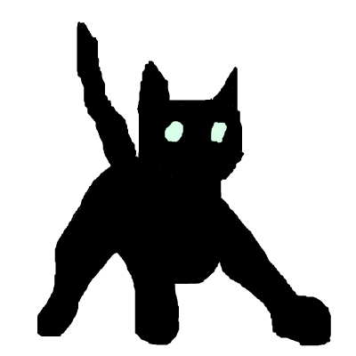
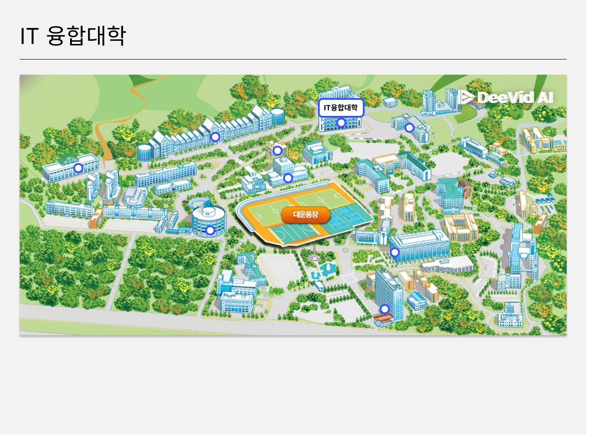
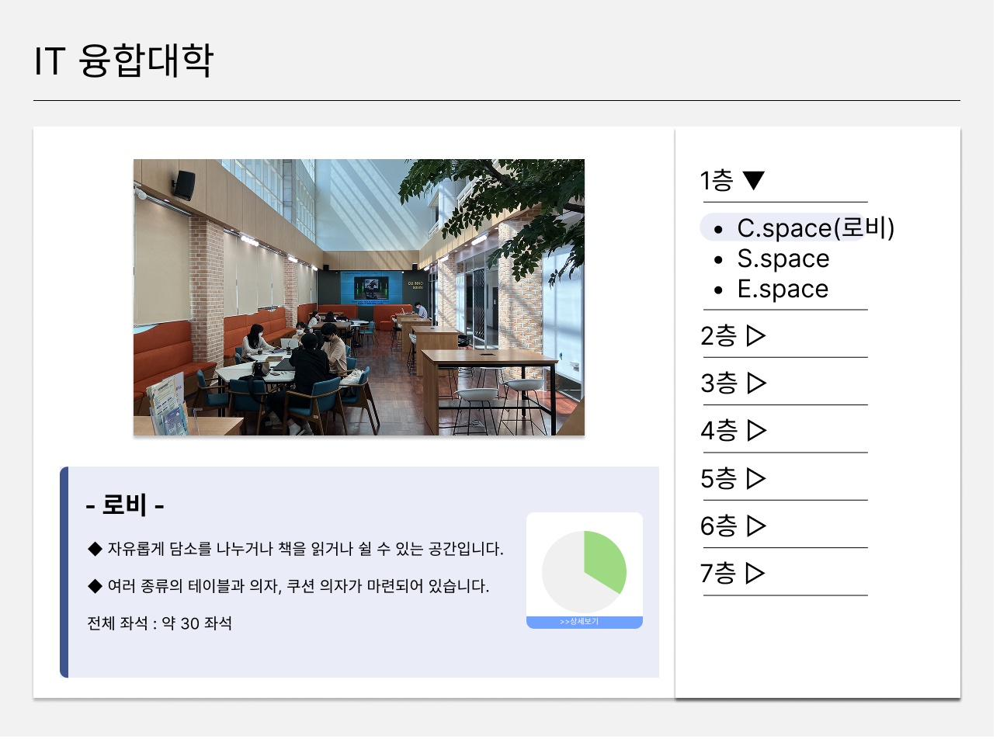
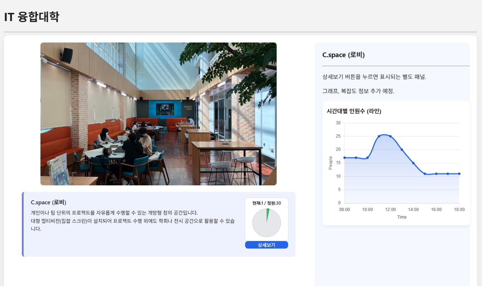
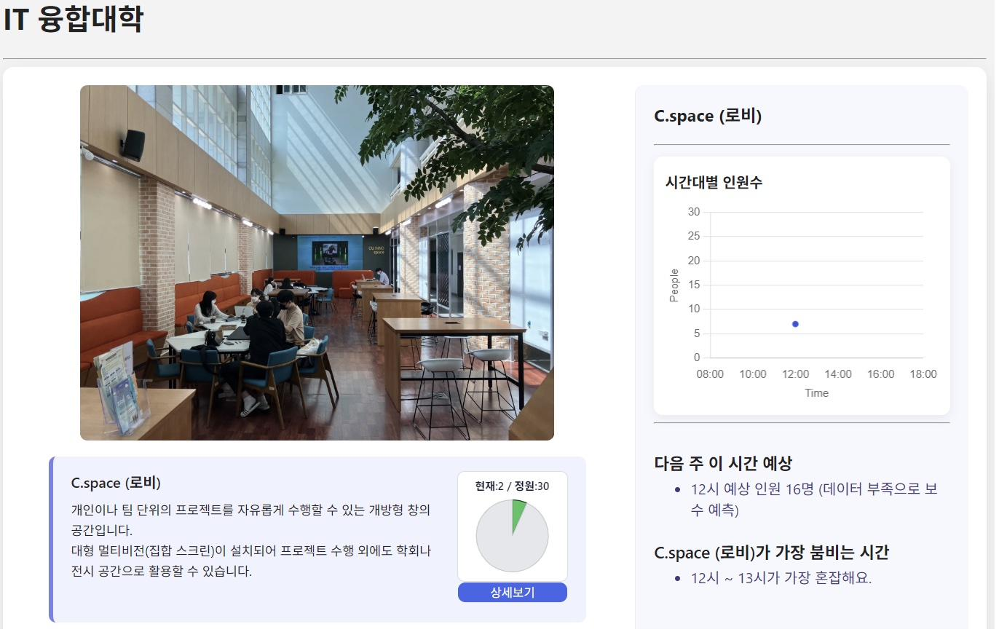
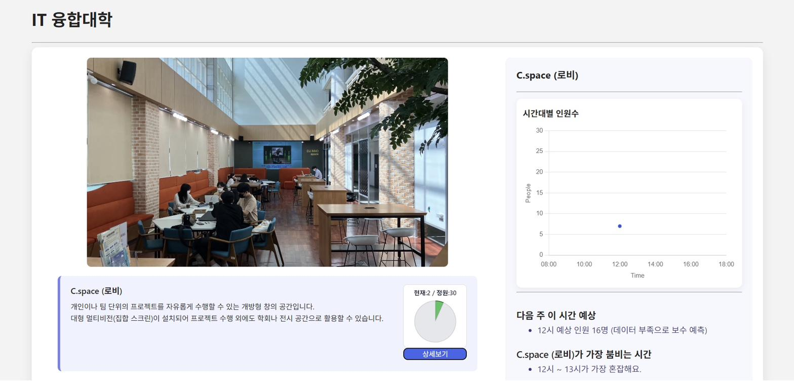
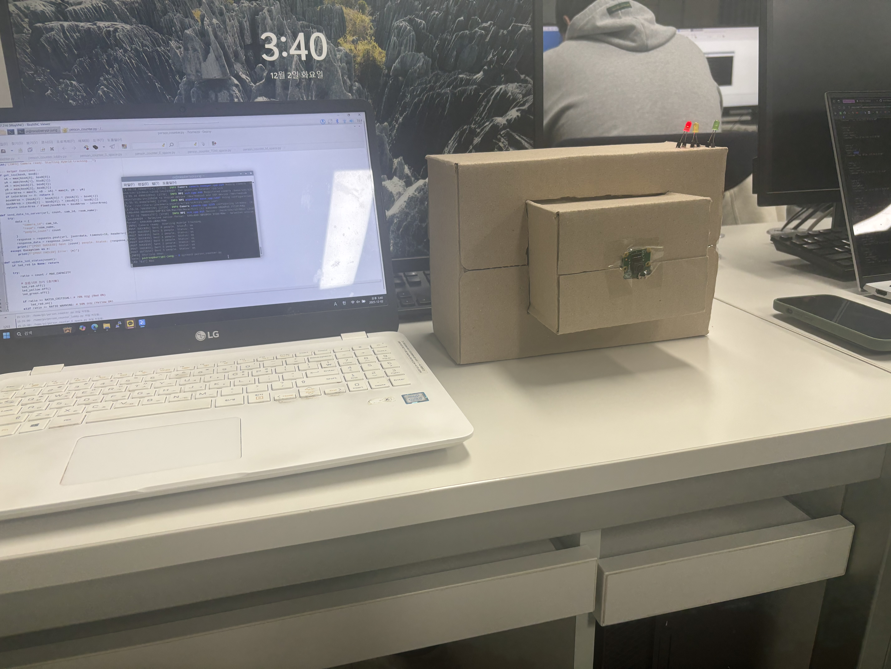

# 🏫 IoT-Crowd-Vis

> **AIoT 기반 실내 혼잡도 시각화 시스템**  
> Raspberry Pi + YOLOv8으로 사람 수를 감지하고, Flask + Chart.js로 실시간 혼잡도를 웹 대시보드에 시각화합니다.

> 본 레포지토리는 팀 프로젝트 전체 코드를 포함하고 있으며,
> 이 중 **백엔드 파트 (Flask API, DB, 배포)** 를 담당하였습니다.

<br>

## 👥 팀원 소개

<table>
  <tr>
    <td align="center">
      <br/><br/>
      <b>정재영</b><br/>
      <a href="https://github.com/Wjdwodud2525">@Wjdwodud2525</a><br/>
      Edge<br/>
      PiCam · YOLOv8+CSRT · LED
    </td>
    <td align="center">
      <br/><br/>
      <b>최산해</b><br/>
      <a href="https://github.com/jinme2">@jinme2</a><br/>
      Backend<br/>
      Flask · MySQL · AI 예측
    </td>
    <td align="center">
      <br/><br/>
      <b>표현수</b><br/>
      <a href="https://github.com/vygustn">@Phytoncide</a><br/>
      Frontend<br/>
      Chart.js · 반응형 UI · 실시간 폴링
    </td>
  </tr>
</table>


## 🙋‍♂️ 담당 파트
팀 프로젝트 중 **백엔드** 파트 담당 (Flask, MySQL, Render 배포)
- 에지(라즈베리파이) 파트: 정재영
- 프론트엔드 파트: 표현수
  
<br>

## 📌 프로젝트 개요

조선대학교 IT융합대학 내 공간(C.space 로비, TDM 스마트팜 실습실 등)을 대상으로, 라즈베리파이 카메라가 실내 인원을 감지하고 웹 대시보드에서 혼잡도를 실시간으로 확인할 수 있는 AIoT 시스템입니다.

<br>

## 🏗️ 시스템 아키텍처

```
[Edge]      Pi Camera → YOLOv8 탐지 → JSON 전송 (5분 주기)
               ↕  (HTTP REST)
[Backend]   Flask API → MySQL 저장 → CSV 백업 (GitHub Actions)
               ↓  (JSON)
[Frontend]  Chart.js 대시보드 → 실시간 혼잡도 + AI 예측 시각화
```

| 계층 | 구성 요소 | 기술 스택 |
|------|-----------|-----------|
| **Edge** | Raspberry Pi 4 + Pi Camera Module 2 | Python, OpenCV, YOLOv8n, picamera2, gpiozero |
| **Backend** | Flask API 서버 | Flask, MySQL (Railway), pandas, scikit-learn |
| **Frontend** | 웹 대시보드 | HTML/CSS/JS, Chart.js |

<br>

## 🖥️ 대시보드 화면

### 캠퍼스 맵 — 건물 선택


<br>

### IT융합대학 — 층별 공간 리스트


<br>

### 공간 상세 — 실시간 혼잡도 + 시간별 그래프


<br>

### 공간 상세 — AI 예측 + 혼잡 시간 분석 (완성본)


<br>

### 반응형 UI


<br>

## ✨ 주요 기능

| 기능 | 설명 |
|------|------|
| **실시간 사람 수 감지** | YOLOv8n 탐지 + CSRT 트래커로 속도·정확도 동시 확보 |
| **혼잡도 3단계 표시** | 🟢 여유(50% 미만) / 🟡 보통(50~70%) / 🔴 혼잡(70% 이상) |
| **LED 하드웨어 연동** | GPIO LED로 현장에서 직관적인 혼잡도 확인 |
| **실시간 대시보드** | Chart.js 꺾은선 그래프, 1분 주기 자동 갱신 |
| **AI 혼잡도 예측** | 선형 회귀(LinearRegression)로 다음 주 동일 시간대 인원 예측 |
| **시간대·요일별 분석** | 평균 혼잡도 패턴 분석 및 "가장 붐비는 시간" 표시 |
| **다중 공간 지원** | `?room=` 파라미터로 공간별 독립 데이터 관리 |
| **자동 일일 백업** | GitHub Actions로 매일 23:59 CSV 백업 + DB 초기화 |

<br>

## 🤖 Edge — YOLOv8 + CSRT 하이브리드 트래킹

단순 YOLOv8만 사용하면 속도가 너무 느리고, CSRT만 쓰면 인식률이 떨어지는 문제를 해결하기 위해 **탐지(YOLO)와 추적(CSRT)을 분리**했습니다.

```
매 프레임:  CSRT 트래커로 기존 객체 위치 추적 (빠름)
10프레임마다: YOLOv8으로 새 객체 탐지 + IoU로 중복 제거
3회 연속 실패: 유령 트래커 자동 삭제 (miss_count)
```

**혼잡도 기준 (정원 대비 비율)**

```python
MAX_CAPACITY         = 30.0   # 공간 최대 수용 인원
RATIO_WARNING        = 0.5    # 50% 이상 → 노란 LED
RATIO_CRITICAL       = 0.7    # 70% 이상 → 빨간 LED
CONFIDENCE_THRESHOLD = 0.35   # YOLO 최소 신뢰도 (옆/뒷모습 감지)
FRAME_SKIP_RATE      = 10     # 10프레임마다 YOLO 실행
```

**모델 선택 배경**

| 구분 | HOG+SVM (1주차) | YOLOv8n (채택) |
|------|----------------|----------------|
| 정확도 | 낮음 (원거리 실패) | 높음 (소형 객체도 탐지) |
| 속도 | 12~15 FPS | 2~5 FPS |
| 결론 | 오탐 많아 교체 | **실시간 추적보다 평균 혼잡도 파악이 목적 → 정확도 우선** |

<br>

## 📡 API 명세

Base URL: `https://iot11-backend.onrender.com` *(현재 서버 운영 종료)*

| 기능 | 메서드 | 엔드포인트 | 설명 |
|------|--------|------------|------|
| 인원 데이터 업로드 | `POST` | `/upload` | YOLO 감지 결과 저장 |
| 최신 기록 조회 | `GET` | `/people?limit=5&room=lobby` | 최근 N개 데이터 |
| 날짜별 조회 | `GET` | `/people/date?date=2025-11-24&room=lobby` | KST 기준 당일 데이터 |
| CSV 다운로드 | `GET` | `/export_csv_simple` | 전체 로그 CSV |
| 시간대별 평균 | `GET` | `/analytics/hourly?room=lobby` | 0~23시 평균 인원 |
| 요일별 평균 | `GET` | `/analytics/weekday?room=lobby` | 월~일 평균 인원 |
| 다음 주 예측 | `GET` | `/analytics/predict?room=lobby` | 선형 회귀 기반 예측 |
| DB 연결 확인 | `GET` | `/test_mysql` | MySQL 상태 확인 |

<details>
<summary>요청/응답 예시 보기</summary>

**POST /upload**
```json
{ "camera_id": "cam01", "room": "IT001", "people_count": 5 }
```
```json
{ "status": "ok", "message": "Saved to MySQL + CSV" }
```

**GET /people**
```json
{
  "status": "ok", "count": 5,
  "data": [{ "id": 1012, "room": "IT001", "people_count": 4, "timestamp": "2025-11-25 14:12:03" }]
}
```

**GET /analytics/predict**
```json
{ "status": "ok", "room": "cspace", "predict_next_week": 14.82, "future_time": "2025-12-09 10:40:02" }
```
</details>

<br>

## 🗄️ DB 테이블 구조 (`people_log`)

| 컬럼 | 타입 | 설명 |
|------|------|------|
| `id` | INT PK AUTO | 고유 ID |
| `camera_id` | VARCHAR | 카메라 식별자 |
| `room` | VARCHAR | 공간 이름 |
| `people_count` | INT | 감지된 사람 수 |
| `timestamp` | DATETIME | 기록 시간 (KST) |

<br>

## 🔄 데이터 흐름

```
Pi Camera
  └─ YOLOv8 탐지 (10프레임마다) + CSRT 추적 (매 프레임)
       └─ count_people() → JSON payload
            └─ POST /upload  (5분 주기, 비동기 스레딩)
                 └─ MySQL 저장 + CSV 백업
                      └─ GET /analytics/*
                           └─ Chart.js 대시보드 갱신 (1분 주기)
```

<br>

## 📁 프로젝트 구조

```
IoT-Crowd-Vis/
├── docs/                       # README 이미지 리소스
├── backend/                    # 최산해 — Flask API 서버
│   ├── server.py               # Flask 메인 서버
│   ├── daily_job.py            # GitHub Actions 일일 백업
│   ├── all_data.csv            # 누적 데이터
│   └── requirements.txt
├── edge/                       # 정재영 — 라즈베리파이
│   ├── person_counter_lobby.py
│   ├── person_counter_E_space.py
│   ├── person_counter_S_space.py
│   ├── person_counter_TDM_space.py
│   └── person_counter.py
├── frontend/                   # 표현수 — 웹 대시보드
│   ├── app.py
│   ├── templates/
│   └── static/
├── .github/workflows/          # GitHub Actions 자동 백업
└── README.md
```

<br>

## 📸 실제 동작 사진

<table>
  <tr>
    <td></td>
    <td></td>
  </tr>
</table>

<br>

## 🔗 관련 링크

- [📄 Notion 프로젝트 문서](https://www.notion.so/2de71605d6dc818fa857ed4792eda407?source=copy_link)
